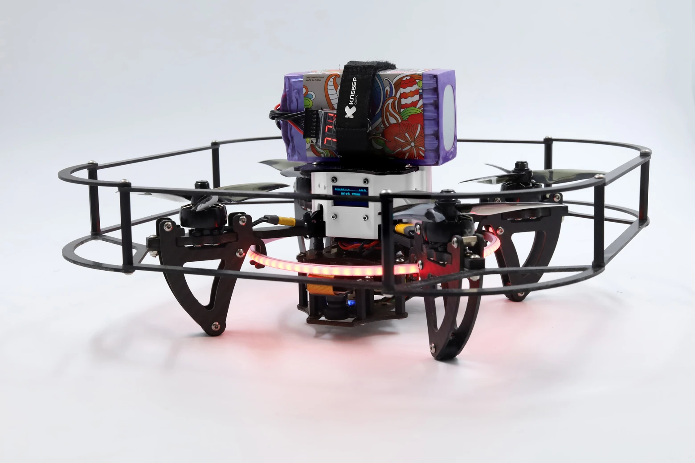

# clover2

**Klever** is a modern educational and research platform featuring a programmable quadcopter, designed for rapid prototyping, learning, and autonomous drone development.

The platform combines reliable modern hardware with a up-to-date software stack. At its core — a high-performance flight controller based on STM32H7 running PX4, providing high computing frequency and stable control algorithms, alongside a Raspberry Pi 5 as an onboard computer for running ROS 2 nodes, computer vision, and custom logic.

The new Klever focuses on a modern robotics ecosystem:

- **ROS 2** — for building scalable, distributed, and reliable control systems
- **Docker** — for environment isolation, reproducible builds, and easy deployment
- **Ready-to-use containers and project templates** — to get started in minutes
- **Open source** — for learning and customization

This approach makes the platform equally suitable for beginners — who with a pre-configured system image, examples, and detailed documentation can quickly run their first flight and start programming without complex setup — and for advanced developers who need a stable and reliable foundation for implementing complex projects: autonomous navigation, computer vision tasks, drone swarm development, as well as research and industrial solutions.

The kit includes a fully configured Raspberry Pi image with all necessary software, libraries, and development tools. All software and documentation are open source and available on [GitHub](https://github.com/klever-coex/clover2).
