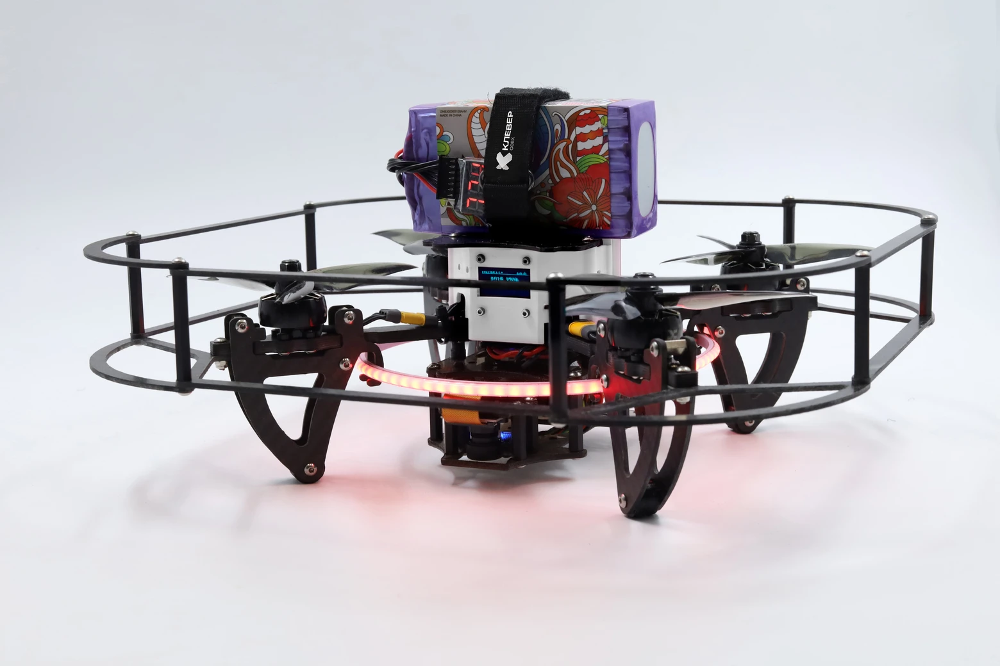

# clover2

**Klever** is an educational quadcopter kit engineered with industry standards in mind. The kit provides everything required for assembly, configuration, and advanced autonomous operation.

Combining modern hardware and cutting-edge software stack, the platform features a high-performance STM32H7-based flight controller running PX4 firmware, ensuring high computational stability for complex control algorithms. Raspberry Pi 5 serves as an onboard computer for ROS 2 nodes, computer vision, and custom user applications.

The upgraded Klever is optimized for the modern robotics ecosystem:

- **ROS 2**: Building scalable, distributed, and reliable control systems.
- **Docker**: Ensuring environment isolation and seamless deployment. 
- **Pre-built containers and project templates**: Immediate start.
- **Open source**: Complete transparency with open-source code for customization and study.

Whether you are a beginner or an expert, Klever scales with you. Beginners can bypass complex setups using the preconfigured Raspberry Pi images and detailed documentation. Experienced developers can leverage the platform as a robust foundation for autonomous navigation, computer vision, swarm intelligence, and applied robotics research.

The kit includes a fully configured Raspberry Pi image with all necessary software, libraries, and development tools. Learn more on [klever-doc.tech](https://klever-doc.tech/ROS2/).
